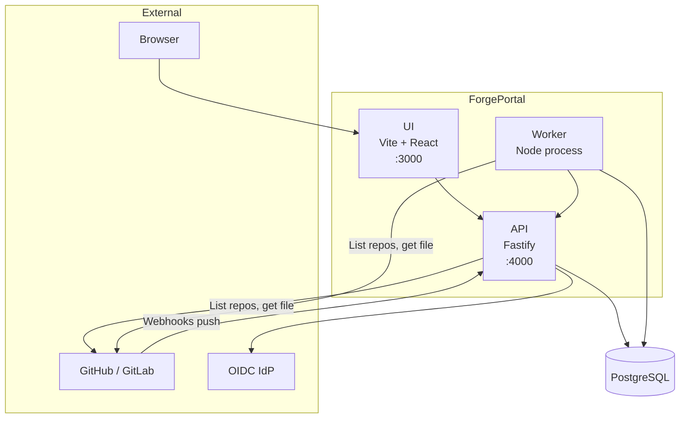

# Architecture

This page describes how ForgePortal is built: its main components, data flows, and the main technology choices.

## How it works

ForgePortal runs as a **multi-process** system: a REST API, a background worker, a React frontend, and a PostgreSQL database. The API is the single entry point for the UI and for external integrations (webhooks, OIDC). The worker runs jobs (repo scan, scorecard evaluation, docs indexing) and executes **action runs** (template steps and one-off actions). All persistent state lives in PostgreSQL.

- **UI** — Single-page app (React, Vite). Calls the API for catalog, templates, actions, auth. No direct DB or SCM access.
- **API** — Fastify server. Serves REST endpoints, OIDC callback, CSRF protection, webhook receiver. Reads/writes DB; calls SCM only when handling webhooks or when the worker is not used for discovery (e.g. admin-triggered operations). Enqueues jobs (repo-scan, scorecard-eval, docs-index) into the job queue.
- **Worker** — Long-running Node process. Polls the **job queue** (table `jobs`) and runs handlers (repo-scan, scorecard-eval, docs-index). Separately, the **action runner** (same process) polls the **action_runs** table, claims runs, executes actions (SCM + platform), and advances template runs. The worker talks to the DB and to SCM providers (GitHub/GitLab) to list repos and read files.
- **PostgreSQL** — Stores entities, entity_sources, relations, jobs, action_runs, template_runs, scorecards, evaluations, permissions, plugin overrides, and app config (e.g. migrations, seed).

Webhooks (Git push) hit the API; if the push touches `entity.yaml` or docs, the API enqueues entity-refresh or docs-index jobs. Discovery can also be driven by **scheduled repo scans** (worker) using `discovery.orgs` from config.

## Key concepts

:::tip Summary
- **API** = single HTTP entry point (REST, webhooks, OIDC). **Worker** = jobs + action runs, no public HTTP by default (metrics on optional port).
- **Data flow**: UI → API → DB; SCM webhooks → API → DB (+ job enqueue); Worker → DB + SCM.
- **Tech**: Fastify (API), React + Vite (UI), Node (Worker), PostgreSQL. OIDC for auth; Handlebars for template rendering.
:::

## Technology choices

| Area | Choice | Rationale |
|------|--------|-----------|
| **API** | Fastify | Performance, TypeScript-friendly, plugin ecosystem (cookie, session, CSRF). |
| **UI** | React + Vite | Fast dev experience, standard ecosystem; Vite for build and dev server. |
| **Database** | PostgreSQL | ACID, JSONB, full-text search (GIN + tsvector), job queue and action runs in same DB. |
| **Auth** | OIDC | Works with any IdP (Keycloak, Okta, Auth0, Azure AD); no vendor lock-in. |
| **Templating** | Handlebars | Simple, safe for user-defined templates; step inputs support `{{var}}` expressions. |
| **Monorepo** | pnpm workspaces + Turborepo | Single repo for API, UI, worker, packages; shared types and build cache. |

The worker is a **separate process** (not in the API) so that heavy or long-running work (scans, scorecard evaluations, action runs) does not block HTTP. Concurrency is controlled per process (e.g. action runner concurrency, job poll loop).
