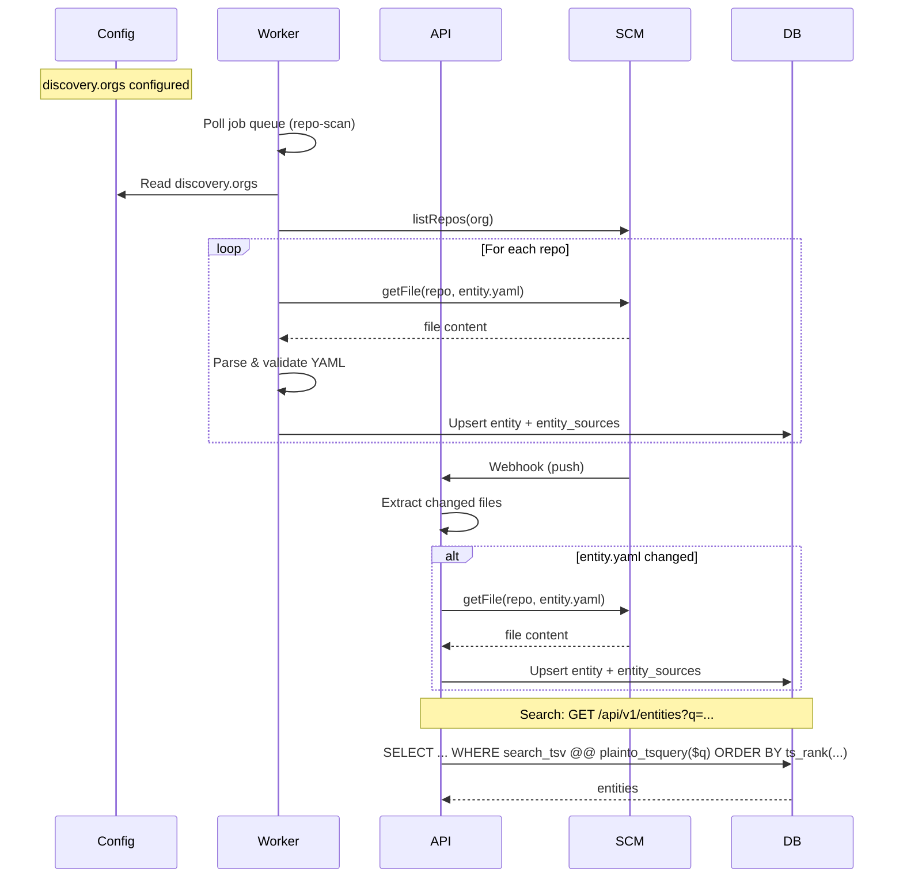

# Catalog & Discovery

The catalog is the set of **entities** (services, components, etc.) that ForgePortal knows about. Entities are **discovered** from Git (GitHub/GitLab) in two ways: **scheduled repo scan** and **webhooks**. Once ingested, they are **searchable** via PostgreSQL full-text search.

## How it works

1. **Discovery** — Either the worker runs a **repo scan** (per org from `discovery.orgs`) or the API receives a **push webhook** and detects changes to `entity.yaml` (or `discovery.entityFilePath`).
2. **Ingestion** — For each repo with a valid entity file, the system fetches the file via the SCM provider, parses and validates the YAML, then **upserts** the entity (insert or update by kind + namespace + name). It also updates **entity_sources** (provider, repo_url, path, last_seen_at).
3. **Search** — The UI and API query entities with filters (kind, namespace, owner, lifecycle) and optional **full-text query**. Search uses a **GIN** index on a **tsvector** column (`search_tsv`) and `plainto_tsquery` + `ts_rank` for relevance.

:::tip Key concepts
- **Scan** = worker job over `discovery.orgs`; lists repos, reads `entity.yaml`, upserts. Scheduled (e.g. cron) or manual (Admin → Scan).
- **Webhook** = push event → API checks if `entity.yaml` (or docs) changed → refresh entity or enqueue docs-index.
- **FTS** = PostgreSQL `search_tsv` (tsvector), GIN index, `plainto_tsquery('english', q)` and `ts_rank` for ordering.
:::

## Discovery: scan vs webhook

| Mechanism | Trigger | Use case |
|-----------|---------|----------|
| **Repo scan** | Scheduled (e.g. every N minutes) or manual (Admin → Scan) | Bulk discovery of all repos in configured orgs; initial load and periodic sync. |
| **Webhook** | Push to default branch (GitHub/GitLab) | Fast update when someone pushes a change to `entity.yaml` or docs. |

Scan requires **discovery.orgs** in config (and SCM credentials). Webhook requires a registered webhook URL and (for GitHub) optional secret verification. If the push touches the entity file, the API can re-fetch the file and upsert the entity; if it touches docs paths, it may enqueue a **docs-index** job instead.

## Ingestion

- **Upsert** = insert if no entity exists for (kind, namespace, name); otherwise update. Conflict is resolved by **kind + namespace + name**.
- **entity_sources** is updated so the system knows the provider, repo_url, path, and last_seen_at.
- **search_tsv** is maintained (via trigger or application logic) from entity fields (e.g. name, description, tags) for full-text search.

## Search (FTS)

- **Column**: `entities.search_tsv` (tsvector, e.g. built from name, description, tags).
- **Index**: GIN on `search_tsv` for fast `@@` queries.
- **Query**: `plainto_tsquery('english', $q)` so the user query is normalized for phrase/single-word search.
- **Ranking**: `ts_rank(search_tsv, query)` is used to order results by relevance.

The catalog list/search API accepts a `q` parameter; when present, the DB filters with `search_tsv @@ plainto_tsquery(...)` and orders by rank.
