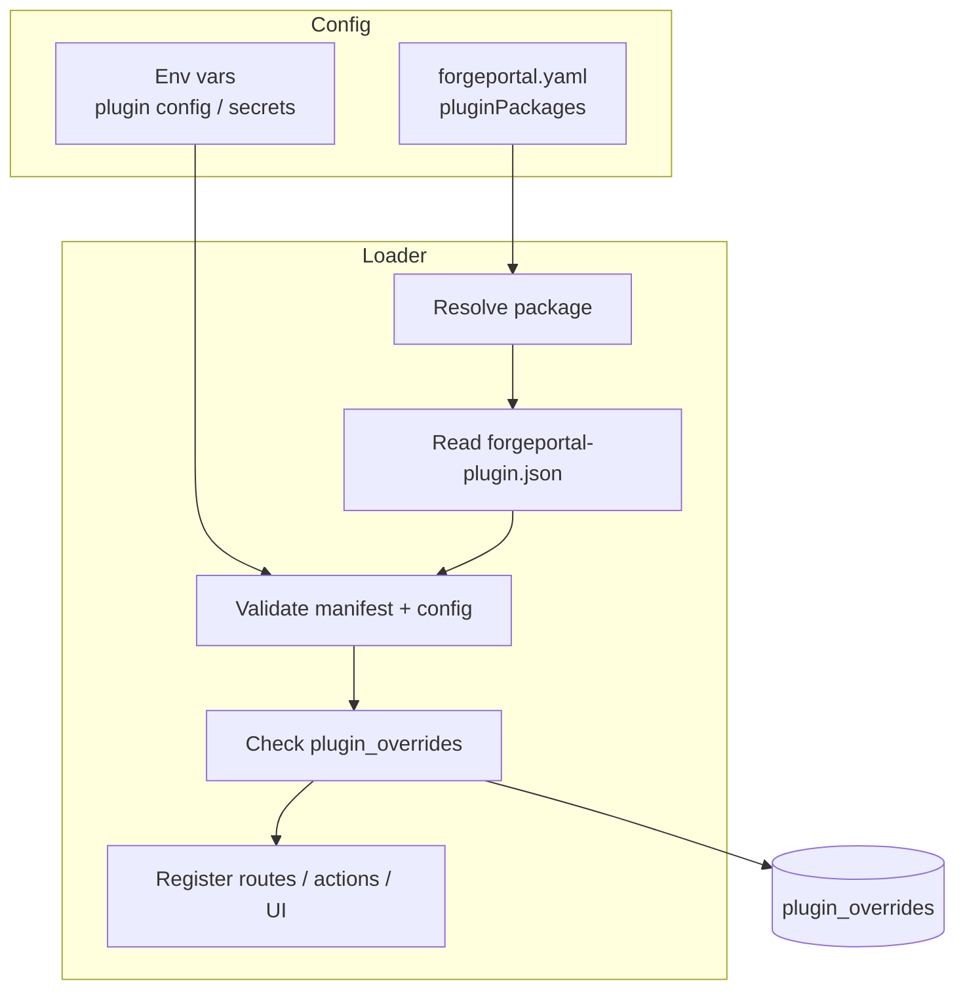

# Plugin System

ForgePortal can be extended with **plugins**: npm packages that register UI components (entity tabs, cards, routes), backend actions and routes, or both. Plugins are declared in config, loaded at startup, and must expose a **manifest** (`forgeportal-plugin.json`) and implement the **plugin SDK** contract. This page covers the three plugin types, the manifest format, lifecycle, and SDK overview.

## How it works

1. **Discovery** — At startup, the API (or loader) reads **plugin packages** from config (e.g. `pluginPackages.packages` in `forgeportal.yaml` or env). Each entry is an npm package name (e.g. `@myorg/forge-plugin-pagerduty`).
2. **Validation** — The loader resolves the package and reads **forgeportal-plugin.json** (or the configured manifest path). It validates the manifest (name, version, `forgeportal.engineVersion`, `type`, `capabilities`) and optional **config** schemas. Plugin-specific config and secrets can come from `forgeportal.yaml` or env vars.
3. **Registration** — Backend: action providers and routes are registered with the API. UI: entity tabs, entity cards, and routes are registered with the app. **Enabled** state can be overridden in the DB (`plugin_overrides`) so an admin can disable a plugin without changing config.
4. **Runtime** — UI plugins render when the user visits an entity or a registered route. Backend plugins handle their routes and action invocations.



:::tip Key concepts
- **Three types**: **ui** (entity tabs, entity cards, routes), **backend** (routes, action providers, catalog providers), **fullstack** (both).
- **Manifest** = `forgeportal-plugin.json` in the package: `name`, `version`, `forgeportal.engineVersion`, `forgeportal.type`, `forgeportal.capabilities`, optional `permissions` and `config` (field schemas).
- **Lifecycle**: Config → resolve package → read manifest → validate → (optional) DB override for enabled → register. No hot reload by default; restart required after enable/disable.
:::

## Plugin types

| Type | Purpose |
|------|--------|
| **ui** | Adds entity tabs, entity cards, and/or standalone routes. Runs in the browser; calls the API. |
| **backend** | Adds Fastify routes (e.g. `/api/v1/my-plugin/...`), **action providers** (new action ids), and/or **catalog providers**. Runs in the API process. |
| **fullstack** | Both UI and backend capabilities in one package. |

Capabilities are declared in the manifest so the loader knows what to register (e.g. which entity tab ids, which route paths, which action ids).

## Manifest: `forgeportal-plugin.json`

The manifest lives at the package root (or a configured path). Schema (conceptually):

| Field | Description |
|-------|-------------|
| `name` | npm package name (e.g. `@myorg/forge-plugin-pagerduty`). |
| `version` | Package version (semver). |
| `forgeportal.engineVersion` | Semver range for `@forgeportal/plugin-sdk` (e.g. `^1.0.0`). |
| `forgeportal.type` | `ui` \| `backend` \| `fullstack`. |
| `forgeportal.capabilities` | **ui**: `entityTabs`, `entityCards`, `routes` (ids/paths). **backend**: `routes`, `actionProviders`, `catalogProviders`. |
| `forgeportal.permissions` | Optional list of RBAC permissions required (e.g. `action:run`). |
| `forgeportal.config` | Optional map of config field names to schemas: `type` (string/number/boolean), `description`, `required`, `secret`, `default`. |

**Example** (minimal backend plugin):

```json
{
  "name": "@myorg/forge-plugin-pagerduty",
  "version": "1.0.0",
  "forgeportal": {
    "engineVersion": "^1.0.0",
    "type": "backend",
    "capabilities": {
      "backend": {
        "routes": ["/api/v1/pagerduty"],
        "actionProviders": ["pagerduty.createIncident@v1"]
      }
    },
    "config": {
      "apiEndpoint": { "type": "string", "description": "PagerDuty API base URL" },
      "apiToken": { "type": "string", "secret": true }
    }
  }
}
```

Secrets (e.g. `apiToken`) should be supplied via env vars, not committed in YAML.

## Lifecycle

- **Load** = read config → resolve packages → read manifest → validate (engine version, type, capabilities, config).
- **Override** = if `plugin_overrides` has an entry for the plugin, its `enabled` flag overrides the config (so an admin can disable without editing YAML). Disabled plugins are not registered.
- **Register** = backend: register routes and action/catalog providers; UI: register tabs, cards, routes. No hot reload — restart API/UI after adding or enabling a plugin.

## SDK overview

The **@forgeportal/plugin-sdk** provides types and contracts:

- **UI**: `registerEntityTab(tab)`, `registerEntityCard(card)`, `registerRoute(route)` — used by the UI host to collect plugin contributions.
- **Backend**: `registerActionProvider(provider)`, `registerCatalogProvider(provider)` — used by the API to register new actions or catalog backends.

Plugin packages depend on `@forgeportal/plugin-sdk` and implement the expected exports (e.g. a default function that receives the SDK and calls `register*`). The host (API or UI) loads the package and invokes that function with the SDK instance. See the [Plugin Developer Guide](/docs/plugin-development/overview) and [SDK reference](/docs/plugin-development/sdk-reference) for implementation details.
