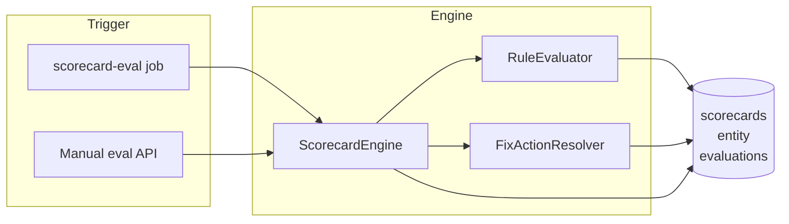

# Scorecards

**Scorecards** define governance rules over catalog entities (e.g. "must have an owner", "must have a README in the repo"). Each scorecard has **rules** with a **level** (e.g. Bronze, Silver, Gold). The **scorecard engine** evaluates entities against these rules; when a rule fails, a **fix action** (e.g. open a PR to add a file) can be suggested or triggered. This page describes rule types, levels, the evaluation flow, and fix actions.

## How it works

1. **Definition** — Scorecards are stored in the DB with a **definition** (name, levels order, rules). Each rule has: `id`, `title`, `level`, `type`, `params`, and optional `fixAction`.
2. **Evaluation** — Triggered by a **worker job** (e.g. `scorecard-eval`) for a (scorecard, entity) pair, or on demand via API. The **RuleEvaluator** runs each rule against the entity (and optionally SCM content).
3. **Result** — Status (`success` \| `failed` \| `partial`), **level** achieved (highest level whose rules all pass), and per-rule results (pass/fail, details). Results can be **cached** with a TTL.
4. **Fix actions** — For a failing rule, a **fix action suggestion** (action id + suggested inputs) can be resolved (built-in resolver or rule-author-defined). The UI can start a template/action run to create a PR or update a file.

:::tip Key concepts
- **Rule types**: `entity.field.exists`, `entity.link.exists`, `scm.file.exists`, `scm.anyOf`. Each has specific `params`.
- **Levels**: Ordered (e.g. Bronze → Silver → Gold). Achieved level = highest level for which all rules at that level pass.
- **Fix action**: Optional per rule; suggests an action (e.g. `scm.createOrUpdateFile@v1`) with pre-filled inputs to remediate the failure.
:::

## Rule types

| Type | Params | Logic |
|------|--------|--------|
| **entity.field.exists** | `field` (string) | Pass if the entity has the given field and it is non-empty (e.g. `owner_ref`, `lifecycle`, `tags`). |
| **entity.link.exists** | `titleContains?`, `urlContains?`, `urlStartsWith?` | Pass if at least one link in `metadata.links` matches the criteria (case-insensitive where applicable). |
| **scm.file.exists** | `path` (string) | Pass if the file exists in the entity's SCM repo (path relative to repo root, e.g. `README.md`). Uses SCM provider to fetch file. |
| **scm.anyOf** | `paths` (string[]) | Pass if **any** of the given paths exist in the repo. |

Evaluation errors (e.g. SCM unavailable) produce a rule result with `pass: false` and an `error` message; they do not crash the evaluator.

## Levels

- **levels** in the scorecard definition are an ordered list (e.g. `["Bronze", "Silver", "Gold"]`).
- The engine computes the **achieved level** by checking, from lowest to highest, whether all rules at that level pass. The result level is the highest level for which all its rules pass.
- **status**: `success` (all rules pass at least the first level), `failed` (evaluation error or no level achieved), `partial` (some rules pass, some fail).

## Evaluation flow

1. **Job** `scorecard-eval` is enqueued with `entityId`, `scorecardId`, and optional `force` (bypass cache).
2. **ScorecardEngine** loads the scorecard and entity, checks cache (unless `force`), then calls **RuleEvaluator** for each rule.
3. **RuleEvaluator** dispatches by `rule.type`, reads entity (and SCM when needed), returns `RuleResult` (pass, details, error).
4. Engine aggregates results, computes level and status, stores **evaluation** in DB (and cache with TTL).

## Fix actions

- **Rule definition** can include an optional `fixAction`: `{ actionId, suggestedInputs }`. This takes priority over the built-in resolver.
- **FixActionResolver** (built-in) can suggest an action for known rule types (e.g. "add README" → `scm.createOrUpdateFile@v1` with path and content).
- The **fix flow** (e.g. "Create PR to fix") in the UI typically starts a **template run** or **action run** using the suggested action and inputs; the action may open a PR or commit to a branch.

Evaluation and fix suggestions do not modify the entity or repo by themselves; they only produce data for the UI and for triggered runs.
