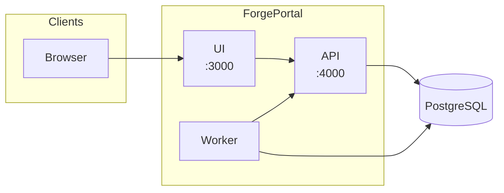

# Overview

**ForgePortal** is an open-source **Internal Developer Portal** that gives platform and engineering teams a single place to discover services, run templates, and enforce standards via scorecards. Think of it as a lightweight, ops-focused alternative to Backstage — built for teams who want a running portal in minutes, not days.

## What is ForgePortal?

ForgePortal provides:

- **Software catalog** — Ingest entities from Git (GitHub, GitLab) via `entity.yaml` files; browse and search by kind, owner, tags.
- **Templates & actions** — Run scaffolded workflows (create repo, open PR, bootstrap CI) from the UI with Handlebars templating.
- **Scorecards** — Define rules (e.g. "must have README", "must have security scan"); evaluate entities and trigger fix-actions (e.g. open a PR to add a file).
- **Docs** — Markdown docs indexed from repos and exposed in the catalog; full-text search.
- **Plugins** — Extend the platform with a simple SDK; load plugins from npm or local packages.
- **Admin UI** — Manage SCM integrations, permissions, plugins, and manual repo scans (platform-admin only).

Authentication is **OIDC-first**: plug in Keycloak, Okta, Auth0, Azure AD, or any OIDC-compliant provider. For local evaluation, the API can run without an issuer (dev-mode bypass).

## ForgePortal vs Backstage

| Criteria | ForgePortal | Backstage |
|----------|-------------|-----------|
| **Deployment time** | Docker Compose up in &lt; 5 min | More setup (Node, build, config) |
| **Stack** | Fastify, React, PostgreSQL | Express, React, PostgreSQL (optional) |
| **Catalog source** | `entity.yaml` in Git + discovery scanner | `catalog-info.yaml` + various processors |
| **Templating** | Handlebars, built-in SCM/platform actions | Scaffolder with Nunjucks, custom steps |
| **Plugins** | npm packages, simple SDK, config in YAML | Rich plugin ecosystem, more complex API |
| **Scorecards / compliance** | Built-in rule engine + fix-actions | Often via custom plugins or Backstage plugins |
| **OIDC** | Any OIDC provider, minimal config | Supports OIDC, more IDP-specific docs |
| **Operational footprint** | API + Worker + UI + DB (4 components) | Monolith or split, more moving parts |
| **Configuration** | Single `forgeportal.yaml` + env vars | `app-config.yaml` and many env vars |

ForgePortal is a good fit if you want a **smaller, ops-oriented portal** with fast onboarding and clear extension points. Choose Backstage if you need its full plugin ecosystem and deeper React/backend customization.

## High-level architecture

The system is made of four main components:

- **UI** — React app (Vite); port 3000. Talks to the API for catalog, templates, auth.
- **API** — Fastify server; port 4000. Serves REST APIs, OIDC callback, webhooks, health.
- **Worker** — Node process (no HTTP by default). Polls job queue (repo-scan, scorecard-eval, docs-index) and runs action runs (SCM + platform actions).
- **PostgreSQL** — Entities, jobs, action runs, permissions, scorecards, plugin overrides.

[**Get started** → Quick Start (Docker)](/docs/getting-started/quick-start-docker) to run the full stack with Docker Compose in under 5 minutes.
